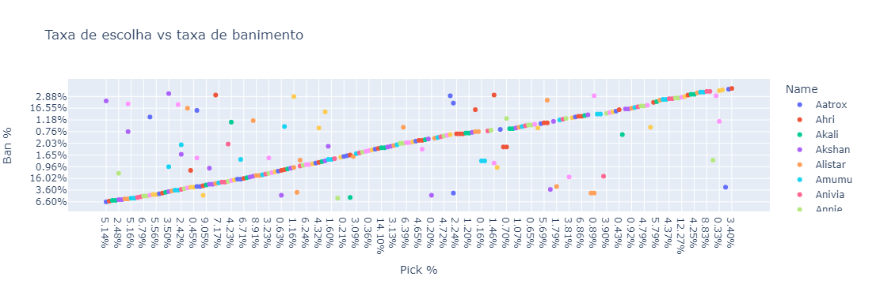
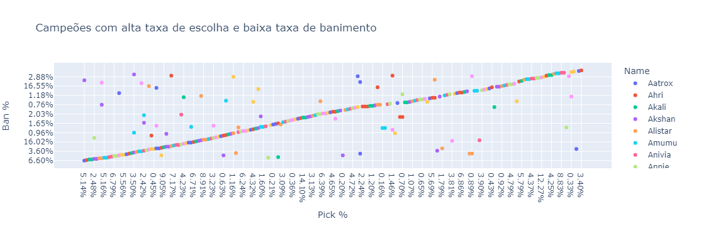

# League Of Legends S13.3 EDA

## Sobre o Dataset:

### Dataset: [kaggle](https://www.kaggle.com/datasets/vivovinco/league-of-legends-stats-s13)

Este dataset contém estatísticas de cada campeão das partidas ranqueadas de League of Legends.

### Contém:

162 linhas e 11 colunas.

A descrição das colunas está listada abaixo:

- Name: Nome do campeão
- Class: Lutador, Assassino, Mago, Atirador, Suporte ou Tanque
- Role: Top, Meio, ADC, Suporte ou Selva
- Tier: God, S, A, B, C ou D
- Score: Pontuação geral do campeão
- Trend: Tendência da pontuação
- Win %: Taxa de vitórias do campeão
- Role %: Taxa de papel desempenhado com o campeão
- Pick %: axa de escolha do campeão
- Ban %: Taxa de banimento do campeão
- KDA: Abates, Mortes e Assistência relacionado ao campeão
#
```python
import numpy as np 
import pandas as pd
import plotly.express as px
import plotly.graph_objects as go
import seaborn as sns
import matplotlib.pyplot as plt
import os
for dirname, _, filenames in os.walk('C:\\Users\\higor\\Documents\\LoLEDA'):
    for filename in filenames:
        print(os.path.join(dirname, filename))
```

    C:\Users\higor\Documents\LoLEDA\LoLChampsStats.csv
    


```python
df = pd.read_csv(r'C:\Users\higor\Documents\LoLEDA\LoLChampsStats.csv', sep=';')
```


```python
df.head()
```


<div>
<table border="1" class="dataframe">
  <thead>
    <tr style="text-align: right;">
      <th></th>
      <th>Name</th>
      <th>Class</th>
      <th>Role</th>
      <th>Tier</th>
      <th>Score</th>
      <th>Trend</th>
      <th>Win %</th>
      <th>Role %</th>
      <th>Pick %</th>
      <th>Ban %</th>
      <th>KDA</th>
    </tr>
  </thead>
  <tbody>
    <tr>
      <th>0</th>
      <td>Aatrox</td>
      <td>Fighter</td>
      <td>TOP</td>
      <td>A</td>
      <td>53.65</td>
      <td>0</td>
      <td>48.17%</td>
      <td>92.75%</td>
      <td>5.14%</td>
      <td>6.60%</td>
      <td>1.85</td>
    </tr>
    <tr>
      <th>1</th>
      <td>Ahri</td>
      <td>Mage</td>
      <td>MID</td>
      <td>S</td>
      <td>55.93</td>
      <td>0</td>
      <td>49.89%</td>
      <td>90.41%</td>
      <td>9.01%</td>
      <td>2.54%</td>
      <td>2.61</td>
    </tr>
    <tr>
      <th>2</th>
      <td>Akali</td>
      <td>Assassin</td>
      <td>MID</td>
      <td>A</td>
      <td>50.75</td>
      <td>0</td>
      <td>48.29%</td>
      <td>71.88%</td>
      <td>6.91%</td>
      <td>11.01%</td>
      <td>2.36</td>
    </tr>
    <tr>
      <th>3</th>
      <td>Akali</td>
      <td>Assassin</td>
      <td>TOP</td>
      <td>C</td>
      <td>40.63</td>
      <td>0</td>
      <td>45.95%</td>
      <td>27.15%</td>
      <td>2.54%</td>
      <td>11.01%</td>
      <td>1.99</td>
    </tr>
    <tr>
      <th>4</th>
      <td>Akshan</td>
      <td>Marksman</td>
      <td>MID</td>
      <td>A</td>
      <td>50.47</td>
      <td>0</td>
      <td>51.67%</td>
      <td>65.15%</td>
      <td>2.48%</td>
      <td>3.47%</td>
      <td>2.27</td>
    </tr>
  </tbody>
</table>
</div>


```python
#Mostrando a quantidade de Nomes, Classes e Funções de Lanes (uma "role" refere-se à posição que um campeão ocupa).
df[['Name','Class','Role']].nunique()
```


    Name     162
    Class      6
    Role       5
    dtype: int64


```python
#Campeões do tier God, seriam os campeões mais fortes nas suas respectivas posições/funções.
df[df['Tier'] == 'God']
```


<div>
<table border="1" class="dataframe">
  <thead>
    <tr style="text-align: right;">
      <th></th>
      <th>Name</th>
      <th>Class</th>
      <th>Role</th>
      <th>Tier</th>
      <th>Score</th>
      <th>Trend</th>
      <th>Win %</th>
      <th>Role %</th>
      <th>Pick %</th>
      <th>Ban %</th>
      <th>KDA</th>
    </tr>
  </thead>
  <tbody>
    <tr>
      <th>12</th>
      <td>Annie</td>
      <td>Mage</td>
      <td>SUPPORT</td>
      <td>God</td>
      <td>75.81</td>
      <td>0</td>
      <td>55.49%</td>
      <td>49.57%</td>
      <td>6.79%</td>
      <td>17.44%</td>
      <td>2.74</td>
    </tr>
    <tr>
      <th>15</th>
      <td>Ashe</td>
      <td>Marksman</td>
      <td>SUPPORT</td>
      <td>God</td>
      <td>81.99</td>
      <td>0</td>
      <td>50.20%</td>
      <td>67.11%</td>
      <td>11.83%</td>
      <td>14.61%</td>
      <td>2.39</td>
    </tr>
    <tr>
      <th>17</th>
      <td>Aurelion Sol</td>
      <td>Mage</td>
      <td>MID</td>
      <td>God</td>
      <td>92.92</td>
      <td>0</td>
      <td>51.16%</td>
      <td>81.74%</td>
      <td>21.06%</td>
      <td>51.38%</td>
      <td>2.54</td>
    </tr>
    <tr>
      <th>25</th>
      <td>Caitlyn</td>
      <td>Marksman</td>
      <td>ADC</td>
      <td>God</td>
      <td>92.85</td>
      <td>0</td>
      <td>49.91%</td>
      <td>93.92%</td>
      <td>21.58%</td>
      <td>21.06%</td>
      <td>2.28</td>
    </tr>
    <tr>
      <th>32</th>
      <td>Darius</td>
      <td>Fighter</td>
      <td>TOP</td>
      <td>God</td>
      <td>77.52</td>
      <td>0</td>
      <td>49.37%</td>
      <td>94.70%</td>
      <td>9.05%</td>
      <td>21.28%</td>
      <td>1.83</td>
    </tr>
    <tr>
      <th>39</th>
      <td>Elise</td>
      <td>Mage</td>
      <td>JUNGLE</td>
      <td>God</td>
      <td>75.59</td>
      <td>0</td>
      <td>51.81%</td>
      <td>97.35%</td>
      <td>6.64%</td>
      <td>18.79%</td>
      <td>2.82</td>
    </tr>
    <tr>
      <th>41</th>
      <td>Ezreal</td>
      <td>Marksman</td>
      <td>ADC</td>
      <td>God</td>
      <td>70.56</td>
      <td>0</td>
      <td>48.74%</td>
      <td>94.82%</td>
      <td>18.04%</td>
      <td>3.24%</td>
      <td>2.40</td>
    </tr>
    <tr>
      <th>44</th>
      <td>Fiora</td>
      <td>Fighter</td>
      <td>TOP</td>
      <td>God</td>
      <td>67.08</td>
      <td>0</td>
      <td>50.66%</td>
      <td>97.55%</td>
      <td>6.71%</td>
      <td>16.02%</td>
      <td>1.72</td>
    </tr>
    <tr>
      <th>48</th>
      <td>Gangplank</td>
      <td>Fighter</td>
      <td>TOP</td>
      <td>God</td>
      <td>75.66</td>
      <td>0</td>
      <td>50.29%</td>
      <td>81.13%</td>
      <td>8.91%</td>
      <td>13.15%</td>
      <td>1.96</td>
    </tr>
    <tr>
      <th>66</th>
      <td>Jarvan IV</td>
      <td>Tank</td>
      <td>JUNGLE</td>
      <td>God</td>
      <td>80.27</td>
      <td>0</td>
      <td>53.30%</td>
      <td>88.06%</td>
      <td>8.35%</td>
      <td>1.88%</td>
      <td>3.42</td>
    </tr>
    <tr>
      <th>67</th>
      <td>Jax</td>
      <td>Fighter</td>
      <td>TOP</td>
      <td>God</td>
      <td>93.48</td>
      <td>0</td>
      <td>51.62%</td>
      <td>88.63%</td>
      <td>11.05%</td>
      <td>25.09%</td>
      <td>1.73</td>
    </tr>
    <tr>
      <th>70</th>
      <td>Jhin</td>
      <td>Marksman</td>
      <td>ADC</td>
      <td>God</td>
      <td>80.69</td>
      <td>0</td>
      <td>51.65%</td>
      <td>93.73%</td>
      <td>17.45%</td>
      <td>3.76%</td>
      <td>3.02</td>
    </tr>
    <tr>
      <th>73</th>
      <td>Kai'Sa</td>
      <td>Marksman</td>
      <td>ADC</td>
      <td>God</td>
      <td>74.47</td>
      <td>0</td>
      <td>50.42%</td>
      <td>95.61%</td>
      <td>17.84%</td>
      <td>3.15%</td>
      <td>2.47</td>
    </tr>
    <tr>
      <th>83</th>
      <td>Kayn</td>
      <td>Fighter</td>
      <td>JUNGLE</td>
      <td>God</td>
      <td>70.18</td>
      <td>0</td>
      <td>49.90%</td>
      <td>97.09%</td>
      <td>8.69%</td>
      <td>6.21%</td>
      <td>2.40</td>
    </tr>
    <tr>
      <th>91</th>
      <td>Lee Sin</td>
      <td>Fighter</td>
      <td>JUNGLE</td>
      <td>God</td>
      <td>88.46</td>
      <td>0</td>
      <td>49.14%</td>
      <td>87.55%</td>
      <td>12.66%</td>
      <td>4.92%</td>
      <td>2.72</td>
    </tr>
    <tr>
      <th>97</th>
      <td>Lulu</td>
      <td>Support</td>
      <td>SUPPORT</td>
      <td>God</td>
      <td>70.18</td>
      <td>0</td>
      <td>49.39%</td>
      <td>97.76%</td>
      <td>9.10%</td>
      <td>8.76%</td>
      <td>3.00</td>
    </tr>
    <tr>
      <th>98</th>
      <td>Lux</td>
      <td>Mage</td>
      <td>SUPPORT</td>
      <td>God</td>
      <td>90.45</td>
      <td>0</td>
      <td>50.42%</td>
      <td>74.70%</td>
      <td>14.10%</td>
      <td>11.54%</td>
      <td>2.49</td>
    </tr>
    <tr>
      <th>104</th>
      <td>Maokai</td>
      <td>Tank</td>
      <td>JUNGLE</td>
      <td>God</td>
      <td>96.36</td>
      <td>0</td>
      <td>52.96%</td>
      <td>74.75%</td>
      <td>8.65%</td>
      <td>30.35%</td>
      <td>2.92</td>
    </tr>
    <tr>
      <th>109</th>
      <td>Mordekaiser</td>
      <td>Fighter</td>
      <td>TOP</td>
      <td>God</td>
      <td>68.62</td>
      <td>0</td>
      <td>51.79%</td>
      <td>73.51%</td>
      <td>6.39%</td>
      <td>13.07%</td>
      <td>1.92</td>
    </tr>
    <tr>
      <th>111</th>
      <td>Morgana</td>
      <td>Mage</td>
      <td>SUPPORT</td>
      <td>God</td>
      <td>70.52</td>
      <td>0</td>
      <td>50.58%</td>
      <td>91.10%</td>
      <td>7.11%</td>
      <td>26.40%</td>
      <td>2.48</td>
    </tr>
    <tr>
      <th>112</th>
      <td>Nami</td>
      <td>Support</td>
      <td>SUPPORT</td>
      <td>God</td>
      <td>69.90</td>
      <td>0</td>
      <td>50.22%</td>
      <td>99.59%</td>
      <td>8.99%</td>
      <td>2.98%</td>
      <td>3.14</td>
    </tr>
    <tr>
      <th>115</th>
      <td>Nautilus</td>
      <td>Tank</td>
      <td>SUPPORT</td>
      <td>God</td>
      <td>71.31</td>
      <td>0</td>
      <td>50.96%</td>
      <td>94.82%</td>
      <td>9.52%</td>
      <td>9.06%</td>
      <td>2.35</td>
    </tr>
    <tr>
      <th>151</th>
      <td>Samira</td>
      <td>Marksman</td>
      <td>ADC</td>
      <td>God</td>
      <td>72.44</td>
      <td>0</td>
      <td>52.16%</td>
      <td>98.08%</td>
      <td>11.25%</td>
      <td>30.07%</td>
      <td>2.34</td>
    </tr>
    <tr>
      <th>173</th>
      <td>Sylas</td>
      <td>Mage</td>
      <td>JUNGLE</td>
      <td>God</td>
      <td>73.99</td>
      <td>0</td>
      <td>49.44%</td>
      <td>50.89%</td>
      <td>8.14%</td>
      <td>19.85%</td>
      <td>2.47</td>
    </tr>
  </tbody>
</table>
</div>


```python
#Criando um gráfico que vai mostrar qual é o melhor e o pior campeão em cada Tier.
to_plt = (df.groupby('Tier')
          .apply(lambda x: x.
                 loc[x['Score'].agg(['idxmin', 'idxmax'])]
                 [['Score', 'Name' , 'Role' , 'Win %']]))
to_plt = to_plt.reset_index(level=1, drop=True).reset_index()
```


```python
#Exibindo o melhor e o pior campeão em cada Tier
px.bar(to_plt,'Name' , 'Score' , 'Tier' ,hover_data=['Role' , 'Win %'], title='Melhor e pior campeão em cada Tier')
```


```python
#Mostrando o gráfico com a distribuição das pontuações.
px.histogram(df,'Score' , color='Name', title='Distribuição das pontuações')
```


```python
#Exibindo o gráfico da distribuição das porcentagens de vitória.
px.histogram(df, x='Win %', color='Name', title='Distribuição das porcentagens de vitória')
```


```python
#Taxa de escolha vs taxa de banimento
px.scatter(df, 'Pick %' , 'Ban %' ,'Name',title='Taxa de escolha vs taxa de banimento')
```


```python
#Rotas com as taxas de vitória mais altas
to_plt = df.groupby(['Role' ,'Win %' ,'Name']).size().sort_index(ascending = False).reset_index()
px.bar(to_plt, 'Role','Win %','Name',width=650, height=1000, title='Rotas com as taxas de vitória mais altas')
```


```python
#Estes são os campeões com as maiores pontuaçõe
to_plt = df.groupby(['Score','Name','Role']).size().sort_index(ascending = False).reset_index()
px.bar(to_plt, 'Name','Score','Role',width=2500, title='Campeões com as maiores pontuações')
```


```python
#Estes são os campeões com alta taxa de vitória e baixa taxa de banimento
px.scatter(df,'Win %' , 'Ban %' , 'Name' ,title='Campeões com alta taxa de vitória e baixa taxa de banimento')
```


```python
#Campeões KDA (Abates, Mortes e Assistências) baixo e com alta taxa de vitória
px.scatter(df,'KDA' , 'Win %' , 'Name',title='Campeões KDA baixo e com alta taxa de vitória')
```


```python
#Campeões com alta taxa de escolha e baixa taxa de banimento
px.scatter(df,'Pick %' , 'Ban %' , 'Name',title='Campeões com alta taxa de escolha e baixa taxa de banimento')
```

